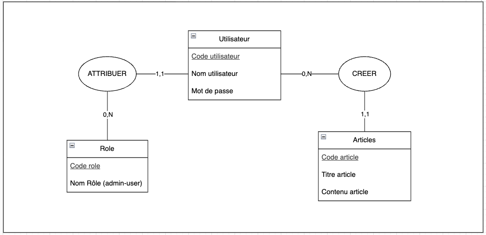
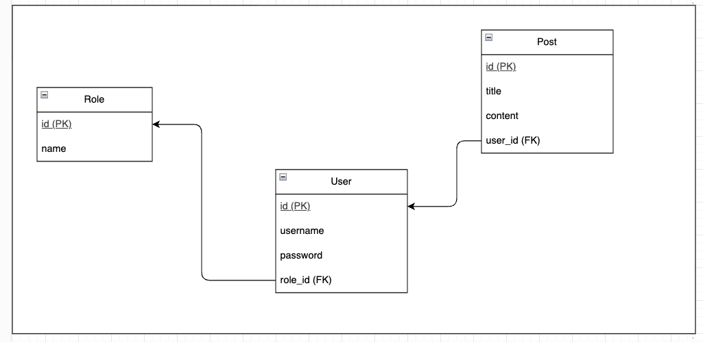

# Blog API - Projet de Pratique et d'Amélioration des Compétences

## 📚 Contexte et Objectifs

Ce projet a été réalisé dans le cadre de ma formation au Titre Professionnel **Concepteur Développeur d'Applications (CDA)** avec pour objectif de :

* Consolider mes compétences en développement backend.
* Maîtriser la création d'une API REST sécurisée avec **Node.js**, **Express** et **PostgreSQL**.
* Mettre en place une authentification sécurisée et une gestion des droits d'accès.
* Apprendre à documenter et à tester correctement une API.
* Préparer le projet à un déploiement professionnel.

Il s'agit d'un projet d'entraînement personnel visant à m'améliorer et à appliquer les bonnes pratiques vues en formation.

---

## ⚙️ Technologies utilisées

* **Node.js** (version ESModules)
* **Express.js**
* **Sequelize** (ORM)
* **PostgreSQL**
* **argon2** pour le hashage des mots de passe
* **jsonwebtoken (JWT)** pour l'authentification
* **express-validator** pour la validation des données
* **Swagger (swagger-jsdoc + swagger-ui-express)** pour la documentation
* **Assert (Node.js)** pour les tests

---

## 🏗️ Architecture du Projet

Le projet suit une architecture de type **MVC (Modèle - Vue - Contrôleur)** adaptée aux API REST :

* **Models** : Définis avec Sequelize, représentent les entités (User, Role, Post).
* **Controllers** : Contiennent la logique métier (authentification, gestion des articles).
* **Routes** : Gèrent les points d'entrée de l'application.
* **Middlewares** : Sécurisent et valident les requêtes.

Cette structure assure une séparation claire des responsabilités et facilite la maintenance et l'évolutivité.

---

## 🗄️ Base de Données & Conception

Le projet utilise une base de données relationnelle PostgreSQL.

### Modèles présents :

* **User** : utilisateurs avec id, username, mot de passe hashé, roleId
* **Role** : rôles utilisateurs (Admin, User)
* **Post** : articles avec titre, contenu, et référence vers l'utilisateur auteur

### Diagrammes

* MCD : 
* MLD : 

---

## ⚙️ Installation et Lancement

### 1. Cloner le projet

```bash
git clone <url_du_repo>
cd blog-api
```

### 2. Installer les dépendances

```bash
npm install
```

### 3. Configurer le fichier `.env` (à ne pas diffuser publiquement)

**Important :** Les variables d'environnement doivent être créées dans un fichier `.env` local qui ne doit jamais être publié ou partagé. Voici les clés nécessaires :

```
PORT=3000
DB_NAME=blogapi
DB_USER=blogapi
DB_PASSWORD=blogapi
DB_HOST=localhost
DB_PORT=5432
JWT_SECRET=supersecret
```

**Note :** Le contenu du fichier `.env` n'est donné ici qu'à titre indicatif pour l'installation locale et ne doit pas être publié dans un environnement réel.

### 4. Initialiser la base de données

```bash
npm run reset-and-seed
```

### 5. Lancer le serveur

```bash
npm run dev
```

L'API est disponible sur :

```
http://localhost:3000/api
```

La documentation Swagger est disponible sur :

```
http://localhost:3000/api-docs
```

---

## 🔐 Authentification & Sécurité

* Les utilisateurs peuvent s'inscrire via `/api/register`.
* Se connecter via `/api/login` et obtenir un token JWT.
* Utiliser ce token pour accéder aux routes protégées :

```http
Authorization: Bearer <votre_token>
```

Les actions sensibles comme créer, modifier ou supprimer un article nécessitent un rôle "Admin".

---

## 🔗 Principales Routes de l'API

| Méthode | URL             | Accès       | Description             |
| ------- | --------------- | ----------- | ----------------------- |
| POST    | /api/register   | Public      | Inscription utilisateur |
| POST    | /api/login      | Public      | Connexion utilisateur   |
| GET     | /api/posts      | Authentifié | Liste des articles      |
| GET     | /api/posts/\:id | Authentifié | Détail d'un article     |
| POST    | /api/posts      | Admin       | Créer un article        |
| PUT     | /api/posts/\:id | Admin       | Modifier un article     |
| DELETE  | /api/posts/\:id | Admin       | Supprimer un article    |

La documentation complète de chaque route est disponible dans Swagger.

---

## 📚 Documentation Swagger

Swagger est intégré et accessible via :

```
http://localhost:3000/api-docs
```

Elle permet de visualiser et de tester toutes les routes directement avec un token JWT.

---

## 🛡️ Sécurité du Projet

* **Mots de passe** : hashés avec **argon2**.
* **Authentification** : via **JWT**.
* **Contrôle des rôles** : seuls les "Admin" peuvent créer, modifier ou supprimer des articles.
* **Validation des données** : avec **express-validator**.
* **Middleware global de gestion des erreurs**.
* **Bonne gestion des variables d'environnement** pour protéger les données sensibles.

---

## 🧪 Tests

Les tests sont écrits en utilisant le module natif **Assert** de Node.js pour rester simple et léger.

### Pour exécuter les tests :

```bash
npm run test
```

Tests réalisés :

* Authentification (login, register)
* Gestion des articles (GET, POST, PUT, DELETE)
* Vérification des erreurs 401 / 403 et des cas limites

---

## 🚀 Déploiement & Environnement

Ce projet est prévu pour être déployé dans un environnement type **Docker** ou sur un PaaS comme **Heroku**, **Render** ou **Railway**.

Prochaine étape envisagée : création d'un fichier **docker-compose.yml** pour faciliter le déploiement multi-environnement.

---

## 📈 Veille Technologique

* Intégration de **Swagger** pour améliorer la documentation et les tests d'API.
* Mise en place de bonnes pratiques de sécurité selon les recommandations **ANSSI**.
* Suivi des nouvelles versions de Node.js, Express et des bonnes pratiques API REST.
* Préparation au déploiement Docker et DevOps.

---

## 👤 Auteur

Ce projet a été réalisé par **Alex** dans le but de :

* Développer mes compétences backend
* M'entraîner à produire un code professionnel, documenté et sécurisé
* Préparer l'obtention du **Titre Professionnel Concepteur Développeur d'Applications (CDA)**

---

📫 N'hésitez pas à me contacter pour toute question ou retour sur ce projet !
